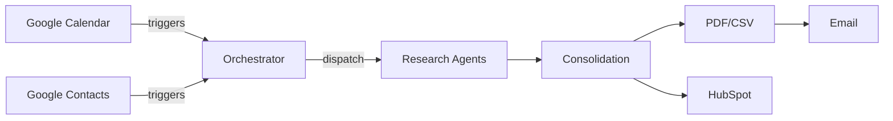

# A2A-research-workflow

Automated Agent-to-Agent (A2A) research workflow for company data enrichment, HubSpot integration, and standardized PDF/CSV reporting using Python, GitHub Actions, AWS, and Docker.

## Project Overview

This repository provides a skeleton implementation of the A2A research workflow. It orchestrates multiple research agents, consolidates their results, and produces PDF and CSV dossiers. HubSpot integration and Google Calendar/Contacts triggers are prepared but not yet fully implemented.

## Architecture

