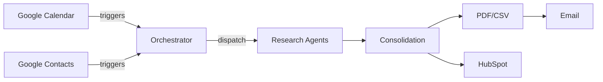

# A2A-research-workflow

Automated Agent-to-Agent (A2A) research workflow for company data enrichment, HubSpot integration, and standardized PDF/CSV reporting using Python and GitHub Actions.

The workflow operates exclusively in live mode and requires valid credentials for Google Calendar, Google Contacts, HubSpot, and an SMTP server.

## Project Overview

This repository provides a skeleton implementation of the A2A research workflow. It orchestrates multiple research agents, consolidates their results, and produces PDF and CSV dossiers. HubSpot integration and Google Calendar/Contacts triggers are prepared but not yet fully implemented.

## Architecture



## Setup Instructions

1. Create and activate a Python 3.11 environment.
2. Install dependencies:
   ```bash
   pip install -r requirements.txt
   ```
   The Google Calendar and Contacts integrations require the
   `google-api-python-client` and `google-auth` packages. Missing Google
   API libraries log a `google_api_client_missing` step for Calendar and
   Contacts.
3. Set required environment variables as needed. SMTP/IMAP/HubSpot/Google variables are configured in `.env` and documented in [`ops/CONFIG.md`](ops/CONFIG.md).
4. Adjust trigger words in `config/trigger_words.txt` or point `TRIGGER_WORDS_FILE` to a custom list.

### Centralised paths

All log, export and artefact locations are resolved through
`config.settings.SETTINGS`.  The default layout stores workflow logs in
`logs/workflows/`, generated artefacts in `artifacts/` and report
exports in `output/exports/` relative to the project root.  To customise
the locations set the following environment variables before the
application starts:

| Environment variable | Description |
| --- | --- |
| `PROJECT_ROOT` | Base directory used when resolving relative paths. |
| `LOGS_DIR` / `WORKFLOWS_SUBDIR` | Override the log directory or the workflow sub-directory. |
| `OUTPUT_DIR` / `EXPORTS_SUBDIR` | Override the output directory or exports sub-directory. |
| `EXPORTS_DIR` | Absolute path for exports (takes precedence over `OUTPUT_DIR`). |
| `ARTIFACTS_DIR` | Directory used for intermediate artefacts. |

`SETTINGS` is a dataclass and can be patched in tests for temporary
directories (see `tests/conftest.py`).  All modules reference it instead
of hard-coded strings, ensuring consistent behaviour across containers
and environments.

## Structured logging

All integrations emit diagnostics through `core.utils.log_step(source, stage, details, severity=...)`.
The helper enriches every record with the active workflow identifier, severity
and variant before writing to the JSONL telemetry stream.  Integration modules
must not create their own loggers or print statements; instead they should
describe the relevant event in `details` and set the severity to `"error"` or
`"critical"` for failure paths.  This keeps calendar, contacts, HubSpot and
email integrations aligned with the orchestrator’s structured logging model and
ensures downstream tooling receives consistent telemetry across all data
sources.

## LIVE Setup

1. Create a `.env` file and fill in the credentials (SMTP/IMAP/HubSpot/Google variables see [`ops/CONFIG.md`](ops/CONFIG.md)).
2. Start the orchestrator with Docker Compose:
   ```bash
   docker compose -f ops/docker-compose.yml up
   ```
3. For scheduled runs via GitHub Actions, define repository secrets:
   - `GOOGLE_CLIENT_ID`
   - `GOOGLE_CLIENT_SECRET`
   - `GOOGLE_REFRESH_TOKEN`
   - `HUBSPOT_ACCESS_TOKEN`
   - `SMTP_HOST`
   - `SMTP_PORT`
   - `SMTP_USER`
   - `SMTP_PASS`
   - `SMTP_SECURE`
   - `MAIL_FROM` (sender address; replaces deprecated `SMTP_FROM`)

HubSpot requests automatically retry on HTTP 429/5xx responses with exponential backoff and jitter to smooth over transient
errors. The legacy `HUBSPOT_PORTAL_ID` secret is no longer required because the workflow only needs the private app token.

PDF generation relies on WeasyPrint system libraries, installed by the Dockerfile and the CI workflow.

## Google OAuth & Token Rotation

> **Note:** <span style="color:red">v2-only</span> – legacy Google OAuth environment names (previous client ID/secret or JSON variants) will fail at startup.

The refresh token is bound to the exact client (ID/secret); mixing clients causes `invalid_grant` errors. To re-issue a refresh token, generate a consent URL with `access_type=offline` and `prompt=consent`. Only the v2 client (`GOOGLE_CLIENT_ID`/`GOOGLE_CLIENT_SECRET`) is supported.

## LIVE mode

`LIVE_MODE=1` (default) hard-fails when Google OAuth, SMTP or HubSpot configuration is missing. The calendar integration probes the token/client pair and may log `invalid_grant` if the refresh token was revoked or belongs to a different client. Re-issue the token with `access_type=offline` and `prompt=consent`.

## Workflow Description

1. Poll Google Calendar and Contacts for new entries containing trigger words.
2. Normalize each trigger with its creator e‑mail and source.
3. Run duplicate checks in HubSpot.
4. Execute research agents and classify results.
5. Consolidate data and generate PDF/CSV outputs.
6. Optionally enrich HubSpot with core fields and attach the PDF.

### Email Reply Processing

Reminder e-mails include deterministic ``Message-ID`` headers derived from the
task or event identifier.  `integrations.email_reader.fetch_replies()` stores
the identifiers of processed messages and uses the ``In-Reply-To`` and
``References`` headers to correlate replies back to their tasks.  Duplicate
messages are skipped idempotently while activity is emitted via
``core.utils.log_step`` under the ``email_reader`` source, ensuring the
structured telemetry stream captures every reply-handling outcome.  The detailed
flow is documented in [`docs/email_reply_processing.md`](docs/email_reply_processing.md).

## Data Model

### Two‑Layer Company Model

The research workflow distinguishes between **core company data** and
**HubSpot‑specific data**.  This separation enables the project to
remain portable – you can reuse the core model with other CRMs or data
pipelines – while still populating all available fields in HubSpot.

1. **Core Schema** – The universal, lean representation of a company
   that is independent of any CRM.  Required fields are:

   | Field | Description |
   | --- | --- |
   | `company_name` | Official company name |
   | `domain` | Company web domain (without protocol) |
   | `industry_group` | High‑level industry cluster such as “Manufacturing” or “Energy” |
   | `industry` | Specific sector or market focus, e.g. “Renewable Energy” |
   | `description` | Free‑text description from notes or agent research |

   Optional fields include `contact_info` (email, phone), `country`
   (ISO‑3166 code) and `classification` (mapping to WZ/NACE/ISIC).  No
   sales‑specific fields (owner, revenue, etc.) live in the core model.

2. **HubSpot Mapping Layer** – A separate dictionary of CRM‑specific
   properties.  When a report is synced to HubSpot, the core fields
   are mapped onto HubSpot property names (see
   [`docs/hubspot_mapping.md`](docs/hubspot_mapping.md) for details).
   Additional fields such as `city`, `postal_code`, `number_of_employees`,
   `total_revenue`, `lead_status` or `ideal_customer_profile_tier` are
   optional and can be supplied via this layer.  A set of
   `company_keywords` is automatically generated from the core
   `industry` and `description` to aid search in HubSpot.  The mapping
   occurs exclusively in `integrations/hubspot_api.py` and is decoupled
   from the agents and orchestrator.

### Rationale for Dropping Classification Numbers

Earlier versions of this project relied on economic classification numbers (e.g. WZ 2008,
NACE, ÖNACE, NOGA) to categorise companies.  While these codes are useful for
statistical analysis, they are opaque to most business users, evolve over
time and differ across jurisdictions.  Maintaining mappings between
multiple classification systems introduces friction and slows down
automation.

To simplify the research workflow the core company model has been
refactored.  Agents that research or compare companies now rely on
`industry_group`, `industry` and `description` as their primary
criteria.  The earlier classification numbers are added only when
needed for backward compatibility via the optional `classification`
field.

### Example Core & HubSpot Structure

After consolidating the outputs of the research agents you will obtain
a core record such as:

```json
{
  "company_name": "SolarTech GmbH",
  "domain": "solartech.de",
  "industry_group": "Energy",
  "industry": "Renewable Energy",
  "description": "Solar panel manufacturer with focus on B2B distribution",
  "contact_info": {"email": "info@solartech.de", "phone": "+49 89 123456"},
  "country": "DE"
}
```

If you wish to enrich HubSpot with additional details you can add a
`hubspot` section:

```json
{
  "core": {
    "company_name": "SolarTech GmbH",
    "domain": "solartech.de",
    "industry_group": "Energy",
    "industry": "Renewable Energy",
    "description": "Solar panel manufacturer with focus on B2B distribution"
  },
  "hubspot": {
    "city": "Munich",
    "postal_code": "80331",
    "number_of_employees": 250,
    "total_revenue": "45000000",
    "lead_status": "Open",
    "company_owner": "Max Mustermann",
    "ideal_customer_profile_tier": "Tier 1"
  }
}
```

Only the core section is used to produce the PDF/CSV reports.  The
`hubspot` section is consumed by `upsert_company()` to feed the HubSpot
CRM.

## Environment Variables

| Variable | Description | Default |
| --- | --- | --- |
| `SMTP_HOST` | SMTP server hostname | – |
| `SMTP_PORT` | SMTP server port | `587` |
| `SMTP_USER` | SMTP username | – |
| `SMTP_PASS` | SMTP password | – |
| `MAIL_FROM` | Sender e‑mail address (`SMTP_FROM` is deprecated; auto-aliases to `MAIL_FROM`) | `SMTP_USER` |
| `SMTP_SECURE` | SMTP security mode (`ssl`/`starttls`) | `ssl` |
| `ALLOWLIST_EMAIL_DOMAIN` | Allow outbound emails only to addresses in this domain | – |
| `MAIL_TO` | Recipient e‑mail for reports | – |
| `TRIGGER_WORDS_FILE` | Path to trigger words list | `config/trigger_words.txt` |
| `GOOGLE_CLIENT_ID` | Google OAuth client ID | – |
| `GOOGLE_CLIENT_SECRET` | Google OAuth client secret | – |
| `GOOGLE_REFRESH_TOKEN` | Google OAuth refresh token | – |
| `GOOGLE_CALENDAR_IDS` | Comma-separated calendar IDs to poll | `primary` |
| `CAL_LOOKAHEAD_DAYS` | Days ahead to fetch events | `14` |
| `CAL_LOOKBACK_DAYS` | Days back to include events | `1` |
| `HUBSPOT_ACCESS_TOKEN` | HubSpot private app token | – |
| `USE_PUSH_TRIGGERS` | Disable scheduled polling | `false` |
| `ENABLE_PRO_SOURCES` | Allow pro research agents | `false` |
| `ATTACH_PDF_TO_HUBSPOT` | Upload PDF to HubSpot | `true` |
| `USE_GCP` | Enable Google Cloud features | `false` |
| `RUN_ID` | Identifier for logging | random UUID |
| `STAGE` | Logging stage label | – |
| `GITHUB_REPOSITORY` | Repository for error issues | – |
| `GITHUB_TOKEN` | Token for GitHub issue creation | – |

When `ALLOWLIST_EMAIL_DOMAIN` is configured the recipient address is validated in
`integrations.email_sender` before a send attempt is made.  The normalized
address and allowlisted domain are also forwarded to the low level
`integrations.mailer` helper, which rejects any recipients outside the allowed
domain.  This defence-in-depth setup ensures that even direct uses of the mailer
cannot bypass the allowlist.

## Repository Structure

Key directories:

- `agents/` – individual research agents.
- `core/` – orchestration, classification, consolidation, and workflow helpers.
- `integrations/` – external service clients (HubSpot, Google, email) and templates.
- `output/` – PDF and CSV rendering utilities. The `pdf_render.render_pdf`
  helper now accepts `(rows, fields, meta=None, out_path=None)` and returns the
  written path; the legacy `(mapping, path)` signature is deprecated.
- `schemas/` – JSON schema definitions.
- `compliance/` – GDPR helpers.
- `a2a_logging/` – logging utilities and error definitions.
- `tests/` – unit, integration, and end-to-end tests.
- `ops/` – operational files such as Dockerfile and CI/CD configs.
- `config/` – centralised runtime settings (see `config/settings.py`) and trigger word lists.
## License

MIT
