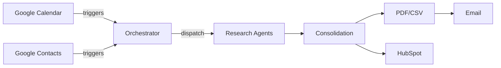

# A2A-research-workflow

Automated Agent-to-Agent (A2A) research workflow for company data enrichment, HubSpot integration, and standardized PDF/CSV reporting using Python and GitHub Actions.

No external cloud services are required; the job runs entirely within GitHub Actions.

## Project Overview

This repository provides a skeleton implementation of the A2A research workflow. It orchestrates multiple research agents, consolidates their results, and produces PDF and CSV dossiers. HubSpot integration and Google Calendar/Contacts triggers are prepared but not yet fully implemented.

## Architecture



## Setup Instructions

1. Create and activate a Python 3.11 environment.
2. Install dependencies:
   ```bash
   pip install -r requirements.txt
   ```
3. Set required environment variables as needed (see `ops/CONFIG.md`).
4. Adjust trigger words in `config/trigger_words.txt` or point `TRIGGER_WORDS_FILE` to a custom list.

## Workflow Description

1. Poll Google Calendar and Contacts for new entries containing trigger words.
2. Normalize each trigger with its creator e‑mail and source.
3. Run duplicate checks in HubSpot.
4. Execute research agents and classify results.
5. Consolidate data and generate PDF/CSV outputs.
6. Optionally enrich HubSpot with core fields and attach the PDF.

## Example Run

```bash
python -m core.orchestrator
```

This will poll Google services for triggers and send notification e‑mails (stubbed in tests). Outputs are written to `output/exports`.

## Environment Variables

| Variable | Description | Default |
| --- | --- | --- |
| `EMAIL_SMTP_HOST` | SMTP server hostname | – |
| `MAIL_SMTP_PORT` | SMTP server port | `587` |
| `EMAIL_SMTP_USER` | SMTP username | – |
| `EMAIL_SMTP_PASS` | SMTP password | – |
| `MAIL_FROM` | Sender e‑mail address | `EMAIL_SMTP_USER` |
| `MAIL_SMTP_SECURE` | Use SSL for SMTP (`true`/`false`) | `true` |
| `MAIL_TO` | Recipient e‑mail for reports | – |
| `TRIGGER_WORDS_FILE` | Path to trigger words list | `config/trigger_words.txt` |
| `GOOGLE_CLIENT_ID` | Google OAuth client ID | – |
| `GOOGLE_CLIENT_SECRET` | Google OAuth client secret | – |
| `GOOGLE_REFRESH_TOKEN` | Google OAuth refresh token | – |
| `GOOGLE_CALENDAR_ID` | Calendar ID to poll | `primary` |
| `HUBSPOT_ACCESS_TOKEN` | HubSpot private app token | – |
| `USE_PUSH_TRIGGERS` | Disable scheduled polling | `false` |
| `ENABLE_PRO_SOURCES` | Allow pro research agents | `false` |
| `ATTACH_PDF_TO_HUBSPOT` | Upload PDF to HubSpot | `true` |
| `USE_GCP` | Enable Google Cloud features | `false` |
| `RUN_ID` | Identifier for logging | random UUID |
| `STAGE` | Logging stage label | – |
| `GITHUB_REPOSITORY` | Repository for error issues | – |
| `GITHUB_TOKEN` | Token for GitHub issue creation | – |

## Repository Structure

Key directories:

- `agents/` – individual research agents.
- `core/` – orchestration, classification, consolidation, and feature flags.
- `integrations/` – external service clients (HubSpot, Google, email) and templates.
- `output/` – PDF and CSV rendering utilities and sample exports.
- `schemas/` – JSON schema definitions.
- `compliance/` – GDPR helpers.
- `logging/` – logging utilities and error definitions.
- `tests/` – unit, integration, and end-to-end tests.
- `ops/` – operational files such as Dockerfile and CI/CD configs.
- `config/` – configuration files such as trigger word list.
## License

MIT
